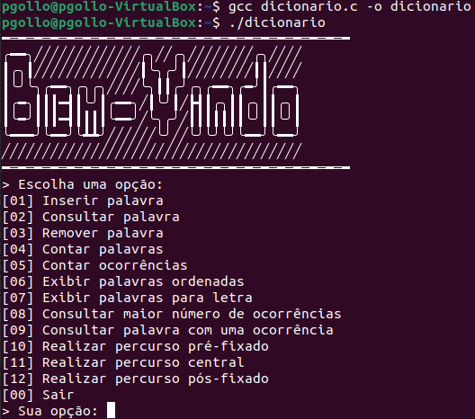

# Dicionário de Palavras: Implementação de ABPs

> A implementação apresentada é um sistema que visa criar um dicionário de palavras otimizado com busca eficiente, usando Árvores Binárias de Pesquisa (ABPs). Diferentes ABPs serão utilizadas para armazenar palavras começando com letras específicas, organizadas em ordem alfabética.

## 🔧 Tecnologias Utilizadas

No projeto, a principal tecnologia adotada foi a linguagem de programação C. O código utiliza conceitos básicos da linguagem e estruturas de dados simples como árvores binárias.

## 💻 Pré-requisitos

Antes de começar, verifique se você atende aos seguintes requisitos:

- Você tem uma máquina que suporta a execução de programas em C
- Você tem um compilador C instalado (por exemplo, GCC)

## 🚀 Executando o Projeto

Para compilar e executar o aplicativo, siga estas etapas:

- Abra um terminal e navegue até o diretório onde o arquivo C está localizado
- Compile o código usando o compilador C (por exemplo, `gcc dicionario.c -o seu_programa`)
- Execute o programa resultante (por exemplo, `./seu_programa`)

## ☕ Entendendo o Código

O sistema utiliza duas principais estruturas de dados: a Lista de Letras e as Árvores Binárias de Pesquisa (ABPs).

A **Lista de Letras** é representada como uma tabela hash por encadeamento aberto. Cada entrada na tabela referencia uma ABP responsável por armazenar palavras que iniciam com a letra correspondente. Essa lista pode ser implementada como um vetor ou uma lista encadeada, proporcionando organização e otimização na busca.

As **Árvores Binárias de Pesquisa (ABPs)** são a espinha dorsal do dicionário. Cada ABP é dedicada a armazenar palavras iniciadas por uma letra específica. Cada nó na ABP contém informações cruciais, incluindo a palavra em si, o número de ocorrências (inicializado como 1 na primeira inserção) e referências para nodos filhos, permitindo uma estrutura de pesquisa binária.

A implementação em C enfatiza a manipulação explícita de ponteiros, evitando o uso de classes, métodos ou funções prontas da linguagem.

As funcionalidades do código incluem operações de inclusão, remoção e consulta no dicionário. A eficiência dessas operações é aprimorada pela organização cuidadosa das ABPs, que permite buscas rápidas e reduz o número de comparações necessárias.

## 🤝 Colaboradores

Agradecemos às seguintes pessoas que contribuíram para este projeto:

<table>
  <tr>
    <td align="center">
      <a href="https://github.com/pbgollo" title="Perfil do Pedro Gollo no GitHub">
         
        
          <b>Pedro Gollo</b>
        
      </a>
    </td>
    <td align="center">
      <a href="https://github.com/FasterThanM" title="Perfil do Franco no GitHub">
         
        
          <b>Franco Michelon</b>
        
      </a>
    </td>
  </tr>
</table>
